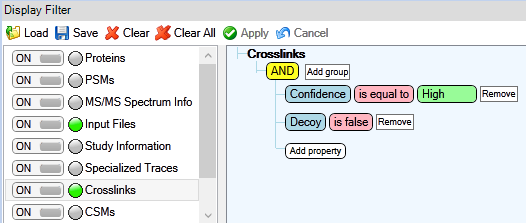
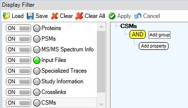
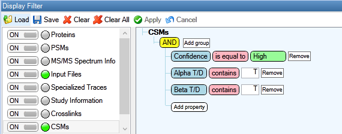
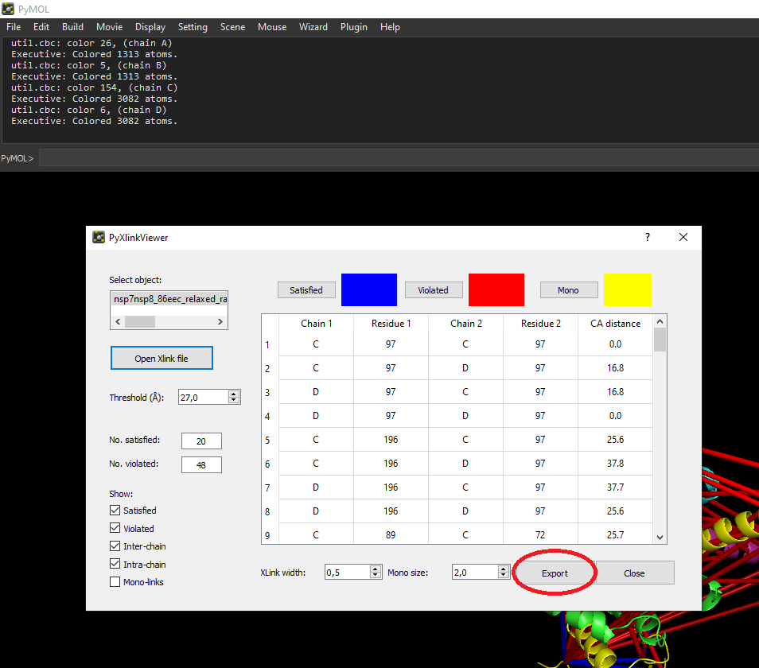

# MS Annika Exporters

Export [MS Annika](https://ms.imp.ac.at/index.php?action=ms-annika) crosslink results to different file formats for different down-stream analysis tools.

## Requirements

Python 3.7+ installation with pandas, openpyxl, biopython and biopandas to run the scripts or to use the Proteome Discoverer Scripting Nodes.
- Install [pandas](https://pandas.pydata.org/): `pip install pandas`
- Install [openpyxl](https://openpyxl.readthedocs.io/en/stable/): `pip install openpyxl`
- Install [biopython](https://biopython.org/): `pip install biopython`
- Install [biopandas](https://biopandas.github.io/biopandas/): `pip install biopandas`

Alternatively there are Windows binaries available in the [Releases](https://github.com/hgb-bin-proteomics/MSAnnika_exporters/releases) tab that don't require a python installation.

## FASTA requirements

FASTA headers need to follow the UniProtKB standard formatting (as described [*here*](https://www.uniprot.org/help/fasta-headers)) otherwise scripts may not work properly. The minimal requirement for FASTA headers is `db|identifier|entry`.

## Exporting MS Annika results to Microsoft Excel

All of the scripts use Micrsoft Excel files as input, for that MS Annika results need to be exported from Proteome Discoverer. It is recommended to first filter results according to your needs, e.g. filter for high-confidence crosslinks and filter out decoy crosslinks as depicted below.

### Exporting Crosslinks



**Figure 1:** Crosslinks filtered for 1% estimated FDR and without decoys.

Results can then be exported by selecting `File > Export > To Microsoft Excel… > Level 1: Crosslinks > Export` in Proteome Discoverer.

### Exporting CSMs



**Figure 2:** All (unvalidated) CSMs.



**Figure 3:** CSMs filtered for 1% estimated FDR and without decoys.

Results can then be exported by selecting `File > Export > To Microsoft Excel… > Level 1: CSMs > Export` in Proteome Discoverer.

## Quick start

- **Exporting to [xiNET](https://crosslinkviewer.org/)**  
  Files needed:
  - result.xlsx - MS Annika crosslink result file(s) exported to .xlsx
  - seq.fasta - FASTA file containing sequences of the crosslinked proteins
  ```
  python xiNetExporter_msannika.py result.xlsx -fasta seq.fasta
  ```
- **Exporting to [xiVIEW](https://xiview.org/xiNET_website/index.php)**  
  Files needed:
  - result.xlsx - MS Annika crosslink result file(s) exported to .xlsx
  - seq.fasta - FASTA file containing sequences of the crosslinked proteins
  ```
  python xiViewExporter_msannika.py result.xlsx -fasta seq.fasta
  ```
- **Exporting to [xiFDR](https://github.com/Rappsilber-Laboratory/xiFDR)**  
  Files needed (requires MS Annika 3.0.2 or later):
  - result.xlsx - MS Annika CSM result file (unvalidated) exported to .xlsx
  ```
  # for xiFDR version < 2.2.1
  python xiFdrExporter_msannika.py result.xlsx
  # for xiFDR version >= 2.2.1
  python xiFdr2.2.1Exporter_msannika.py result.xlsx
  ```
- **Exporting to [pyXlinkViewer (pyMOL)](https://github.com/BobSchiffrin/PyXlinkViewer)**  
  Files needed:
  - result.xlsx - MS Annika crosslink result file(s) exported to .xlsx
  - structure.pdb - 3D structure of the protein (complex) that crosslinks should be mapped to, alternatively you can also just provide the 4-letter code from the [PDB](https://www.rcsb.org/) and the script will fetch the structure from internet
  ```
  python pyXlinkViewerExporter_msannika.py result.xlsx -pdb structure.pdb
  ```
- **Exporting to [XLMS-Tools](https://gitlab.com/topf-lab/xlms-tools)**  
  XLMS-Tools uses the same file format as pyXlinkViewer, therefore the same exporter can be used!
- **Exporting to [XMAS (ChimeraX)](https://github.com/ScheltemaLab/ChimeraX_bundle)**  
  Visualization of MS Annika results works out of the box with .xlsx files exported from Proteome Discoverer.
- **Exporting to [PAE Viewer](http://www.subtiwiki.uni-goettingen.de/v4/paeViewerDemo)**  
  Files needed:
  - pyXlinkViewer_export.csv - Crosslinks exported from pyXlinkViewer as .csv
  ```
  python PAEViewerExporter_msannika.py pyXlinkViewer_export.csv
  ```

## Export to [xiNET](https://crosslinkviewer.org/)

```
EXPORTER DESCRIPTION:
A script to export MS Annika results to xiNET input files (CSV + FASTA).
USAGE:
xiNetExporter_msannika.py f [f ...]
                            [-fasta FASTA]
                            [-ignore IGNORE]
                            [-o OUTPUT]
                            [-h]
                            [--version]
positional arguments:
  f                     MS Annika crosslink result files in Microsoft Excel
                        format (.xlsx) to process.
required arguments:
  -fasta FASTAFILE, --fasta FASTAFILE
                        Fasta file used for crosslink search. Must contain
                        proteins identified in the MS Annika result files.
optional arguments:
  -ignore ACCESSION, --ignore ACCESSION
                        Protein accessions to be ignored. Crosslinks that only
                        link between ignored proteins will not be exported.
                        Supports input of multiple accessions.
  -h, --help            show this help message and exit
  -o OUTPUT, --output OUTPUT
                        Prefix of the output files.
  --version             show program's version number and exit
```

Example usage:

```
python xiNetExporter_msannika.py "202001216_nsp8_trypsin_XL_REP1.xlsx" "202001216_nsp8_trypsin_XL_REP2.xlsx" "202001216_nsp8_trypsin_XL_REP3.xlsx" --fasta SARS-COV-2.fasta -o test --ignore P0DTC1 P0DTD1 P0DTC2
```

Or using the Windows binary:

```
xiNetExporter_msannika.exe "202001216_nsp8_trypsin_XL_REP1.xlsx" "202001216_nsp8_trypsin_XL_REP2.xlsx" "202001216_nsp8_trypsin_XL_REP3.xlsx" --fasta SARS-COV-2.fasta -o test --ignore P0DTC1 P0DTD1 P0DTC2
```

## Export to [xiVIEW](https://xiview.org/xiNET_website/index.php)

```
EXPORTER DESCRIPTION:
A script to export MS Annika results to xiVIEW input files (CSV + FASTA).
USAGE:
xiViewExporter_msannika.py f [f ...]
                             [-fasta FASTA]
                             [-ignore IGNORE]
                             [-o OUTPUT]
                             [-h]
                             [--version]
positional arguments:
  f                     MS Annika crosslink result files in Microsoft Excel
                        format (.xlsx) to process.
required arguments:
  -fasta FASTAFILE, --fasta FASTAFILE
                        Fasta file used for crosslink search. Must contain
                        proteins identified in the MS Annika result files.
optional arguments:
  -ignore ACCESSION, --ignore ACCESSION
                        Protein accessions to be ignored. Crosslinks that only
                        link between ignored proteins will not be exported.
                        Supports input of multiple accessions.
  -h, --help            show this help message and exit
  -o OUTPUT, --output OUTPUT
                        Prefix of the output files.
  --version             show program's version number and exit
```

Example usage:

```
python xiViewExporter_msannika.py "202001216_nsp8_trypsin_XL_REP1.xlsx" "202001216_nsp8_trypsin_XL_REP2.xlsx" "202001216_nsp8_trypsin_XL_REP3.xlsx" --fasta SARS-COV-2.fasta -o test --ignore P0DTC1 P0DTD1 P0DTC2
```

Or using the Windows binary:

```
xiViewExporter_msannika.exe "202001216_nsp8_trypsin_XL_REP1.xlsx" "202001216_nsp8_trypsin_XL_REP2.xlsx" "202001216_nsp8_trypsin_XL_REP3.xlsx" --fasta SARS-COV-2.fasta -o test --ignore P0DTC1 P0DTD1 P0DTC2
```

## Export to [xiFDR](https://github.com/Rappsilber-Laboratory/xiFDR)

**Exporting to and validation with xiFDR requires MS Annika 3.0.2 or later!**

```
EXPORTER DESCRIPTION:
A script to export MS Annika CSM results (.xlsx) to a xiFDR input file (.csv).
CSMs should be unfiltered, therefore include decoys and not be validated for any
FDR.
Warning: Exporter for xiFDR < 2.2.1 currently only reports one/the first protein for
         ambiguous peptides that are found in more than one protein!
USAGE:
xiFdrExporter_msannika.py f [f]
                            [-o OUTPUT]
                            [-h]
                            [--version]
positional arguments:
  f                     Crosslink-Spectrum-Matches (CSMs) exported from
                        MS Annika in Microsoft Excel (.xlsx) format.
optional arguments:
  -o OUTPUT, --output OUTPUT
                        Prefix of the output file.
  -h, --help            show this help message and exit
  --version             show program's version number and exit
```

Example usage (xiFDR version < 2.2.1):

```
python xiFdrExporter_msannika.py XLpeplib_Beveridge_QEx-HFX_DSS_R1.xlsx
```

Or using the Windows binary:

```
xiFdrExporter_msannika.exe XLpeplib_Beveridge_QEx-HFX_DSS_R1.xlsx
```

Example usage (xiFDR version 2.2.1 or later):

```
python xiFdr2.2.1Exporter_msannika.py XLpeplib_Beveridge_QEx-HFX_DSS_R1.xlsx
```

Or using the Windows binary:

```
xiFdr2.2.1Exporter_msannika.exe XLpeplib_Beveridge_QEx-HFX_DSS_R1.xlsx
```

## Export to [PyXlinkViewer for pyMOL](https://github.com/BobSchiffrin/PyXlinkViewer)

A schematic workflow of the implementation can be seen in [*this figure*](img/workflow_pyMOLexporter.png).

```
EXPORTER DESCRIPTION:
A script to export MS Annika results to PyXlinkViewer format for visualizing
crosslinks in pyMOL.
USAGE:
pyXlinkViewerExporter_msannika.py f [f ...]
                                    [-pdb PDB_FILE]
                                    [-go GAP_OPEN_PENALTY]
                                    [-ge GAP_EXTENSION_PENALTY]
                                    [-si SEQUENCE_IDENTITY]
                                    [-allowxlmismatch]
                                    [-o OUTPUT]
                                    [-h]
                                    [--version]
positional arguments:
  f                     MS Annika crosslink result files in Microsoft Excel
                        format (.xlsx) to process.
required arguments:
  -pdb PDB_FILE, --pdb PDB_FILE
                        PDB file of the structure that crosslinks should be
                        exported to/or 4-letter identifier from the PDB
                        (structure will be retrieved from the internet).
optional arguments:
  -go GAP_OPEN_PENALTY, --gap_open GAP_OPEN_PENALTY
                        Gap open penalty for sequence alignment.
                        Default: -10
  -ge GAP_EXTENSION_PENALTY, --gap_extension GAP_EXTENSION_PENALTY
                        Gap extension penalty for sequence alignment.
                        Default: -1
  -si SEQUENCE_IDENTITY, --sequence_identity SEQUENCE_IDENTITY
                        Sequence identity threshold in percent to consider two
                        aligned sequences as matching.
                        Default: 80
  -allowxlmismatch, --allowxlmismatch
                        Flag to report crosslinks that don't link to a crosslink
                        site in the PDB sequence.
                        Default: Do not report such crosslinks.
  -ic, --ignore_chains
                        Ignore specific chains in the PDB file.
                        Default: No chains are ignored.
  -h, --help            show this help message and exit
  -o OUTPUT, --output OUTPUT
                        Prefix of the output files.
  --version             show program's version number and exit
```

Example usage:

```
python pyXlinkViewerExporter_msannika.py "202001216_nsp8_trypsin_XL_REP1.xlsx" "202001216_nsp8_trypsin_XL_REP2.xlsx" "202001216_nsp8_trypsin_XL_REP3.xlsx" --pdb 6yhu.pdb -o test
```

Or using the Windows binary:

```
pyXlinkViewerExporter_msannika.exe "202001216_nsp8_trypsin_XL_REP1.xlsx" "202001216_nsp8_trypsin_XL_REP2.xlsx" "202001216_nsp8_trypsin_XL_REP3.xlsx" --pdb 6yhu.pdb -o test
```

## Export to [XLMS-Tools](https://gitlab.com/topf-lab/xlms-tools)

[XLMS-Tools](https://gitlab.com/topf-lab/xlms-tools) uses the same input format as [pyXlinkViewer](https://github.com/BobSchiffrin/PyXlinkViewer).
Please use the [pyXlinkViewer exporter](#export-to-pyxlinkviewer-for-pymol) to export your results to XLMS-Tools format.

## Export to [XMAS for ChimeraX](https://github.com/ScheltemaLab/ChimeraX_bundle)

Visualization of crosslinks with [XMAS](https://github.com/ScheltemaLab/ChimeraX_bundle) in ChimeraX works without the need of an additional exporter, the Microsoft Excel files exported from Proteome Discoverer can be used directly as evidence files within XMAS.

## Export to [PAE Viewer](http://www.subtiwiki.uni-goettingen.de/v4/paeViewerDemo)

Evaluating predicted structures (e.g. structures created with AlphaFold2) using cross-linking data can easily be done using [PAE Viewer](http://www.subtiwiki.uni-goettingen.de/v4/paeViewerDemo). Exporting MS Annika results to the input format of PAE Viewer requires first exporting to pyXlinkViewer (pyMOL) and then exporting crosslinks from pyXlinkViewer to CSV, as shown in the pyMOL screenshot below:



The exporter takes the following arguments:
```
EXPORTER DESCRIPTION:
A script to export MS Annika results from pyXlinkViewer to PAE Viewer input
files (CSV).
USAGE:
PAEViewerExporter_msannika.py f [f]
                                [-t DISTANCE]
                                [-o OUTPUT]
                                [-h]
                                [--version]
positional arguments:
  f                     Crosslinks exported from pyXlinkViewer in csv format.
optional arguments:
  -t DISTANCE, --threshold DISTANCE
                        threshold (float) that specifies if a crosslink
                        satisfies the crosslinker-specific distance constraint.
  -o OUTPUT, --output OUTPUT
                        Prefix of the output file.
  -h, --help            show this help message and exit
  --version             show program's version number and exit
```

Example usage:

```
python PAEViewerExporter_msannika.py pyXlinkViewer_export.csv
```

Or using the Windows binary:

```
PAEViewerExporter_msannika.exe pyXlinkViewer_export.csv
```

## Finding the shortest cross-linked residue pair for every crosslink

Mapping crosslinks to 3D structures is often ambiguous as the same peptide may appear in more than one chain, creating several possible cross-linked residue pairs. If you only want to find the shortest residue pair/crosslink (e.g. for validating a 3D structure) please check out `find_shortest.py` in the [Crosslink_Utils repo](https://github.com/hgb-bin-proteomics/Crosslink_Utils).

## Using exporters in Proteome Discoverer

To use the xiNET and xiVIEW exporters in Proteome Discoverer, add a "Scripting Node" from the "Post-Processing" tab in the "Workflow Nodes" window to your consensus workflow. You need to specify the following parameters in the Scripting Node:

- Path to Executable: Path of the python installation e.g. `C:\Users\Username\AppData\Local\Programs\Python\Python37\python.exe`
- Command Line Arguments: Path of the exporter script from `scripting_nodes` and `%NODEARGS%` e.g. `C:\Users\Username\Documents\PDScriptingNodes\xiViewExporter_msannikaPD.py %NODEARGS%`
- Requested Tables and Columns: Copy and paste the contents of `pd_tables.txt`

Re-running the consensus worklflow should create the xiNET/xiVIEW files in the study directory.

Tested with Proteome Discoverer 2.5 (version 2.5.0.400).

## Known Issues

[List of known issues](https://github.com/hgb-bin-proteomics/MSAnnika_exporters/issues)

## Citing

If you are using the exporters please cite:
```
MS Annika 2.0 Identifies Cross-Linked Peptides in MS2–MS3-Based Workflows at High Sensitivity and Specificity
Micha J. Birklbauer, Manuel Matzinger, Fränze Müller, Karl Mechtler, and Viktoria Dorfer
Journal of Proteome Research 2023 22 (9), 3009-3021
DOI: 10.1021/acs.jproteome.3c00325
```

If you are using MS Annika please cite:
```
MS Annika 2.0 Identifies Cross-Linked Peptides in MS2–MS3-Based Workflows at High Sensitivity and Specificity
Micha J. Birklbauer, Manuel Matzinger, Fränze Müller, Karl Mechtler, and Viktoria Dorfer
Journal of Proteome Research 2023 22 (9), 3009-3021
DOI: 10.1021/acs.jproteome.3c00325
```
or
```
MS Annika: A New Cross-Linking Search Engine
Georg J. Pirklbauer, Christian E. Stieger, Manuel Matzinger, Stephan Winkler, Karl Mechtler, and Viktoria Dorfer
Journal of Proteome Research 2021 20 (5), 2560-2569
DOI: 10.1021/acs.jproteome.0c01000
```

## License

- [MIT](https://github.com/hgb-bin-proteomics/MSAnnika_exporters/blob/master/LICENSE)

## Contact

[micha.birklbauer@fh-hagenberg.at](mailto:micha.birklbauer@fh-hagenberg.at)
